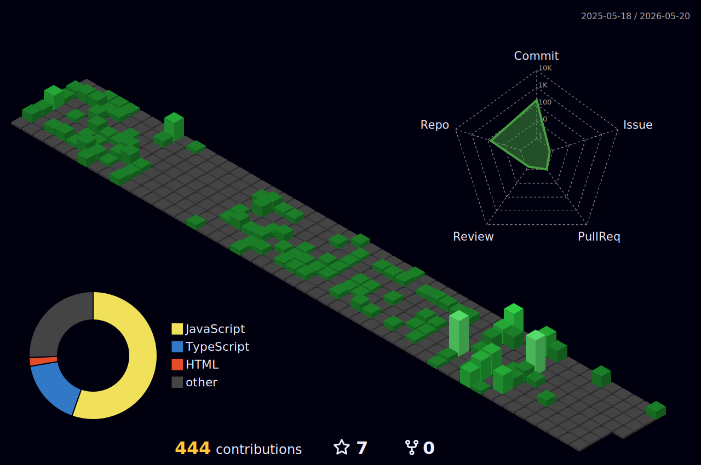

---

# 👋 Hi, I'm Umid Tuxtayev

🚀 **Full-Stack Developer (Backend-oriented)**  
Building scalable APIs and modern web applications.

- 🔭 Building APIs & modern web applications  
- 🌱 Improving **Node.js, NestJS, React & Next.js**  
- 👯 Open to backend & frontend collaboration  
- ⚡ Focused on **real-world scalable systems**

---

# 🚀 Tech Stack

---

# 🔥 Commit Streak

---

# 📈 Contribution Graph

---

# 🐍 Contribution Snake

---

# 📜 About Me

Full-Stack developer who enjoys building real products.

My strength is **backend logic, API design, and database architecture**,  
but I also build **clean and responsive frontend interfaces**.

I focus on **solving real problems, not just writing code.**

---

# 📫 Contact

📧 **Email:** umidtuxtayev84@gmail.com  
📍 **Location:** Samarkand, Uzbekistan
